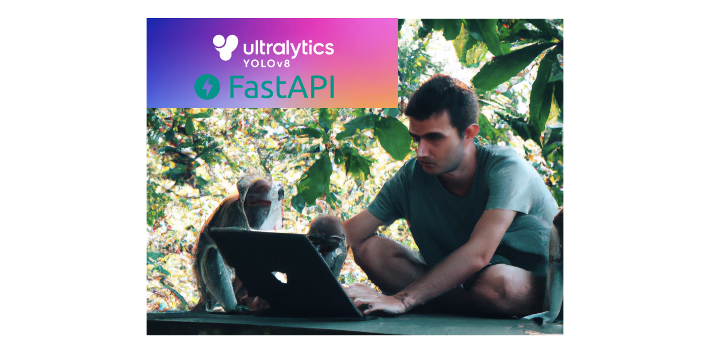
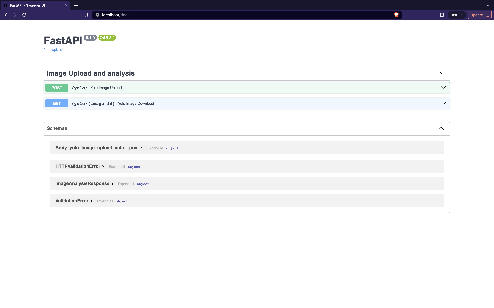

# Hosting YOLOv8 With FastAPI

## Introduction
In the ever-evolving landscape of computer vision and machine learning, two powerful technologies have emerged as key players in their respective domains: YOLO (You Only Look Once) and FastAPI. YOLO has gained fame for its real-time object detection capabilities, while FastAPI has earned a reputation as one of the most efficient and user-friendly web frameworks for building APIs. In this blog post, we'll explore the exciting synergy that can be achieved by hosting YOLOv8, a state-of-the-art YOLO variant, with FastAPI.



First, let's briefly introduce FastAPI. FastAPI is a Python web framework that simplifies the development of APIs with incredible speed and ease. It is designed for high-performance and productivity, offering automatic generation of interactive documentation and type hints, which are a boon for developers. With FastAPI, you can build robust APIs quickly, making it an ideal choice for integrating machine learning models, like YOLOv8, into web applications.

On the other side of the equation is YOLO, a groundbreaking object detection model that has become a cornerstone of computer vision applications. YOLO excels at identifying objects in images and video streams in real-time. YOLOv8 is the latest iteration, bringing even more accuracy and speed to the table. Combining the power of YOLOv8 with the efficiency of FastAPI opens up exciting possibilities for building interactive and efficient object detection applications.

In this blog post, we will dive into the process of hosting YOLOv8 with FastAPI, demonstrating how to create a web-based API that can analyze images. By the end of this guide, you'll have a solid understanding of how to leverage these two technologies to build your own object detection applications, whether it's for security, surveillance, or any other use case that demands accurate and speedy object detection. Let's embark on this journey of integrating the cutting-edge YOLOv8 with the versatile FastAPI framework for a truly powerful and responsive object detection experience.

## Directory Structure
First, I do always like to split my code across multiple files. In
my opinion, it just makes it easier to read for me. I would be doing
a disservice if I didn't accurately show you the structure layout
so you can understand the imports that are happening between files:

```shell
|____yolofastapi
| |____routers
| | |______init__.py
| | |____yolo.py
| |______init__.py
| |____schemas
| | |____yolo.py
| |____detectors
| | |______init__.py
| | |____yolov8.py
| |____main.py
```

At the top level, we have the `yolofastapi` directory which will be our
python application. Within there, there are a few directories:

1. `routers` - The endpoints / REST routers that our application will expose.
               If, for example, you wanted to add a new `GET` endpoint, you
               could add that in this directory.
2. `schemas` - This directory will show our request/response schemas that our
               routers will either expect or return. Pydantic makes the 
               serialization of these objects a breeze!
3. `detectors` - This is the fun stuff! We will put our `yolo` or other detection
                 models/wrappers in this directory. In our example, we will only
                 using `yolov8n`, but you could extend this to other detectors
                 or yolo versions as well.

So, if you see something like:

```python
from yolofastapi.routers import yolo
```

You know understand that it is importing the file at `yolofastapi/routers/yolo.py`!

## Schemas
We will only have a single response schema in our API. Essentially, it will
be a data-type class which returns a few things to the user:

1. The id of the uploaded image
2. The labels our detector found

For example, a response might look like

```json
{
  "id": 1,
  "labels": [
    "vase"
  ]
}
```

Which says "Hey, I detected vases in your image and gave it an 
image id of 1 (in case you want to download it later)!". 

In python, it's really easy to use `pydantic` to do a lot of this
heavy lifting for us:

```python
from pydantic import BaseModel
from typing import Set

class ImageAnalysisResponse(BaseModel):
    id: int
    labels: Set[str]
```

We just have to inherit from the `pydantic.BaseModel` class. Pydantic will
then go and do all of the necessary serialization when our API returns this
`ImageAnalysisResponse` to the user.

These will make a bit more sense when we begin to use them in our routers, so
let's get to it!

## Routers
I now want to dive in to the top level or the entrypoint of our API. The 
entrypoint of APIs are typically their routes (aka endpoints). Our API is
going to support two endpoints:

1. Upload an image and run yolo on it
2. Download an image that yolo annotated for us

Let's start with by creating our router:

```python
# For API operations and standards
from fastapi import APIRouter, UploadFile, Response, status, HTTPException
# Our detector objects
from yolofastapi.detectors import yolov8
# For encoding images
import cv2
# For response schemas
from yolofastapi.schemas.yolo import ImageAnalysisResponse

# A new router object that we can add endpoints to.
# Note that the prefix is /yolo, so all endpoints from
# here on will be relative to /yolo
router = APIRouter(tags=["Image Upload and analysis"], prefix="/yolo")
```

So, we do some standard imports. We will also make a new router
object which we will add our two endpoints to. Note that the router
will be prefixed with `/yolo`. For example, curl calls would be 

```shell
curl http://localhost/yolo
curl http://localhost/yolo/endpoint1
curl http://localhost/yolo/endpoint2
```

We will also keep a record of uploaded/annotated images in memory:

```python
# A cache of annotated images. Note that this would typically
# be some sort of persistent storage (think maybe postgres + S3)
# but for simplicity, we can keep things in memory
images = []
```

In a production setting, you would want some more robust/persistent storage.
A typical paradigm would be to push these to some sort of blob storage and then
keep their URLs in a database (think postgres). For simplicity, though, we will
just keep them in an indexible python array in memory.

Now, we can add our first endpoint!

```python
@router.post("/",
    status_code=status.HTTP_201_CREATED,
    responses={
        201: {"description": "Successfully Analyzed Image."}
    },
    response_model=ImageAnalysisResponse,
)
async def yolo_image_upload(file: UploadFile) -> ImageAnalysisResponse:
    """Takes a multi-part upload image and runs yolov8 on it to detect objects

    Arguments:
        file (UploadFile): The multi-part upload file
    
    Returns:
        response (ImageAnalysisResponse): The image ID and labels in 
                                          the pydantic object
    
    Examlple cURL:
        curl -X 'POST' \
            'http://localhost/yolo/' \
            -H 'accept: application/json' \
            -H 'Content-Type: multipart/form-data' \
            -F 'file=@image.jpg;type=image/jpeg'

    Example Return:
        {
            "id": 1,
            "labels": [
                "vase"
            ]
        }
    """
    contents = await file.read()
    dt = yolov8.YoloV8ImageObjectDetection(chunked=contents)
    frame, labels = await dt()
    success, encoded_image = cv2.imencode(".png", frame)
    images.append(encoded_image)
    return ImageAnalysisResponse(id=len(images), labels=labels)
```

Let's dissect this code. We are adding a new `POST` method to our
api at `/yolo/` (because the router is prefixed with `/yolo`). The route
will return an HTTP 201 with the response body of our `ImageAnalysisResponse`
schema. The route will also expect, as input, a multi-part upload of an image.
When we enter this function, we will first read the image and then pass it to 
our `YoloV8ImageObjectDetection` object (which we will discuss in the next section).
We then use the callable `YoloV8ImageObjectDetection` object to run our analysis,
encode the image in `png` format, and save it in our in-memory array. Finally, we 
return an `ImageAnalysisResponse` object with the id and any detected labels filled
out. At this point, we can successfully upload/analyze/save images in our application.

Let's add one more endpoint to download the images:

```python
@router.get(
    "/{image_id}",
    status_code=status.HTTP_200_OK,
    responses={
        200: {"content": {"image/png": {}}},
        404: {"description": "Image ID Not Found."}
    },
    response_class=Response,
)
async def yolo_image_download(image_id: int) -> Response:
    """Takes an image id as a path param and returns that encoded
    image from the images array

    Arguments:
        image_id (int): The image ID to download
    
    Returns:
        response (Response): The encoded image in PNG format
    
    Examlple cURL:
        curl -X 'GET' \
            'http://localhost/yolo/1' \
            -H 'accept: image/png'

    Example Return: A Binary Image
    """
    try:
        return Response(content=images[image_id - 1].tobytes(), media_type="image/png")
    except IndexError:
        raise HTTPException(status_code=404, detail="Image not found") 
```

We are adding a new `GET` method to our router at `/yolo/<id>`. The route will
return an HTTP 200 if the image ID is in our array, otherwise, it will return a 404.
The body of the response will be a binary PNG image. The application code is a bit
easier here, as all we have to do is index our array and return the encoded image.

So, up to now, we have our two endpoints and are ready to dive into the most
heavy piece of code - our YOLO detector.

## Detectors

The detector is what will analyze our image, annotate it, and 
let us know what it found. For simplicity, we will make it callable, meaning
we will be able to run something like:

```python
x = MyClass()
x()
```

Let's dive in!

First, we have our imports (as always):

```python
# For machine learning
import torch
# For array computations
import numpy as np
# For image decoding / editing
import cv2
# For environment variables
import os
# For detecting which ML Devices we can use
import platform
# For actually using the YOLO models
from ultralytics import YOLO
```

And then we have a relatively simple constructor:

```python
class YoloV8ImageObjectDetection:
    PATH        = os.environ.get("YOLO_WEIGHTS_PATH", "yolov8n.pt")    # Path to a model. yolov8n.pt means download from PyTorch Hub
    CONF_THRESH = float(os.environ.get("YOLO_CONF_THRESHOLD", "0.70")) # Confidence threshold

    def __init__(self, chunked: bytes = None):
        """Initializes a yolov8 detector with a binary image
        
        Arguments:
            chunked (bytes): A binary image representation
        """
        self._bytes = chunked
        self.model = self._load_model()
        self.device = self._get_device()
        self.classes = self.model.names

    def _get_device(self):
        """Gets best device for your system

        Returns:
            device (str): The device to use for YOLO for your system
        """
        if platform.system().lower() == "darwin":
            return "mps"
        if torch.cuda.is_available():
            return "cuda"
        return "cpu"

    def _load_model(self):
        """Loads Yolo8 model from pytorch hub or a path on disk

        Returns:
            model (Model) - Trained Pytorch model
        """
        model = YOLO(YoloV8ImageObjectDetection.PATH)
        return model
```

We are declaring a new class called `YoloV8ImageObjectDetection` 
and we have two class variables:

1. `PATH` - This will be the path to a pretrained model (checkpoint file). 
            If you use the default, we will just load the pretrained one from
            torchhub
2. `CONF_THRESH` - This will be our confidence threshold for detections. For example,
                   if our confidence is 0.5, it means that our model will only show 
                   and annotate detections in an image that have a 50% or higher
                   confidence. Anything lower will be ignored.

Our `__init__` takes a single parameter, `chunked`, which is the raw binary image stream
that was delivered to the API. It then:

* loads the model using the `_load_model` fuction
* set's the most efficient device for our system (cuda/mps/cpu) for the inferences
* gets all of the supported class names for our pretrained model

Up to now, we know how to instantiate this class, but we aren't too sure how to
use it. So, let's look at its `__call__` method:

```python
    async def __call__(self):
        """This function is called when class is executed.
        It analyzes a single image passed to its constructor
        and returns the annotated image and its labels
        
        Returns:
            frame (numpy.ndarray): Frame with bounding boxes and labels ploted on it.
            labels (list(str)): The corresponding labels that were found
        """
        frame = self._get_image_from_chunked()
        results = self.score_frame(frame)
        frame, labels = self.plot_boxes(results, frame)
        return frame, set(labels)
```

By overriding `__call__`, we can run our class with the `()` syntax as discussed
above. The first thing this function does is convert the raw binary image stream
into a numpy array for ease of use. Then, we score the image, meaning that we will
look through the image and see what we can detect. If we detect anything, we will assign
labels and confidences to them! Now that we have a representation of what's in our
image, we can plot the bounding boxes on the image and then return the annotated image
and labels to the caller.

There's a few internal functions, such as:
* `_get_image_from_chunked`
* `score_frame`
* `plot_boxes`
* `class_to_label`

So let's go through those as well to paint a complete picture.

```python
    def _get_image_from_chunked(self):
        """Loads an openCV image from the raw image bytes passed by
        the API.

        Returns: 
            img (numpy.ndarray): opencv2 image object from the raw binary
        """
        arr = np.asarray(bytearray(self._bytes), dtype=np.uint8)
        img = cv2.imdecode(arr, -1)  # 'Load it as it is'
        return img
    
    def score_frame(self, frame):
        """Scores a single image with a YoloV8 model

        Arguments:
            frame (numpy.ndarray): input frame in numpy/list/tuple format.

        Returns:
            results list(ultralytics.engine.results.Results)): Labels and Coordinates of objects detected by model in the frame.
        """
        self.model.to(self.device)
        frame = [frame]
        results = self.model(
            frame, 
            conf=YoloV8ImageObjectDetection.CONF_THRESH, 
            save_conf=True
        )
        return results

    def class_to_label(self, x):
        """For a given label value, return corresponding string label.
        Arguments:
            x (int): numeric label

        Returns:   
            class (str): corresponding string label
        """
        return self.classes[int(x)]

    def plot_boxes(self, results, frame):
        """Takes a frame and its results as input, 
        and plots the bounding boxes and label on to the frame.

        Arguments:
            results (list(ultralytics.engine.results.Results)): contains labels and coordinates predicted by model on the given frame.
            frame (numpy.ndarray): Frame which has been scored.
        
        Returns:
            frame (numpy.ndarray): Frame with bounding boxes and labels ploted on it.
            labels (list(str)): The corresponding labels that were found
        """
        for r in results:
            boxes = r.boxes
            labels = []
            for box in boxes:
                c = box.cls
                l = self.model.names[int(c)]
                labels.append(l)
        frame = results[0].plot()
        return frame, labels
```

Let's go through these.

`_get_image_from_chunked` is a function that just takes our raw binary
image, converts it to a Numpy NDArray, and then returns that to the caller.

`score_frame` is a function that takes an Numpy NDArray as input and it 
passes it to our YOLO model. The YOLO model will go and run all of the 
detections on that frame. It will then return all of the results that it
found to the caller.

`class_to_label` is a function that takes an index as input. It then
searches the class labels in our model, and returns the corresponding item
for the given index to the user. Essentially, this converts an integer label
to a human readable string label.

`plot_boxes` takes the results from the `score_frame` function and the initial
frame. It then loops through each result from `score_frame` and draws a bounding
box around the coordinates in the image. It then labels that bounding box with
the human-readable name from `class_to_label`.

## Putting It All Together
Now, we have all of our individual components built. Let's add a simple
`main.py` which acts as our entrypoint to the system:

```python
from uvicorn import Server, Config
from fastapi import FastAPI
from starlette.middleware.cors import CORSMiddleware
import os

from yolofastapi.routers import yolo

app = FastAPI()

app.add_middleware(
    CORSMiddleware,
    allow_credentials=False,
    allow_origins=["*"],
    allow_methods=["*"],
    allow_headers=["*"],
)

app.include_router(yolo.router)

if __name__ == "__main__":
    port = int(os.environ.get("PORT", 80))
    server = Server(Config(app, host="0.0.0.0", port=port, lifespan="on"))
    server.run()
```

All we are doing here is instantiating a new `FastAPI` app and we added our
`yolo.router` to it which has our two, predefined endpoints.

## Running and Testing
Let's give this a run and test it out!

Before you give it a run, you can checkout and install the requirements defined in the [requirements.txt in GitHub](https://github.com/afoley587/hosting-yolo-fastapi/blob/master/requirements.txt).

After you install those, we can run our API:

```shell
prompt> python yolofastapi/main.py                                 
INFO:     Started server process [65385]
INFO:     Waiting for application startup.
INFO:     Application startup complete.
INFO:     Uvicorn running on http://0.0.0.0:80 (Press CTRL+C to quit)
```

Let's navigate over to a browser at `http://localhost/docs` and you'll see the swagger docs similar to the image below:


Let's go upload an image, analyze it, and then download it to see the labels! Let's watch the video
below:


You have now successfully hosted your first machine learning API with python!

## References
All code can be found [here on github](https://github.com/afoley587/hosting-yolo-fastapi)!